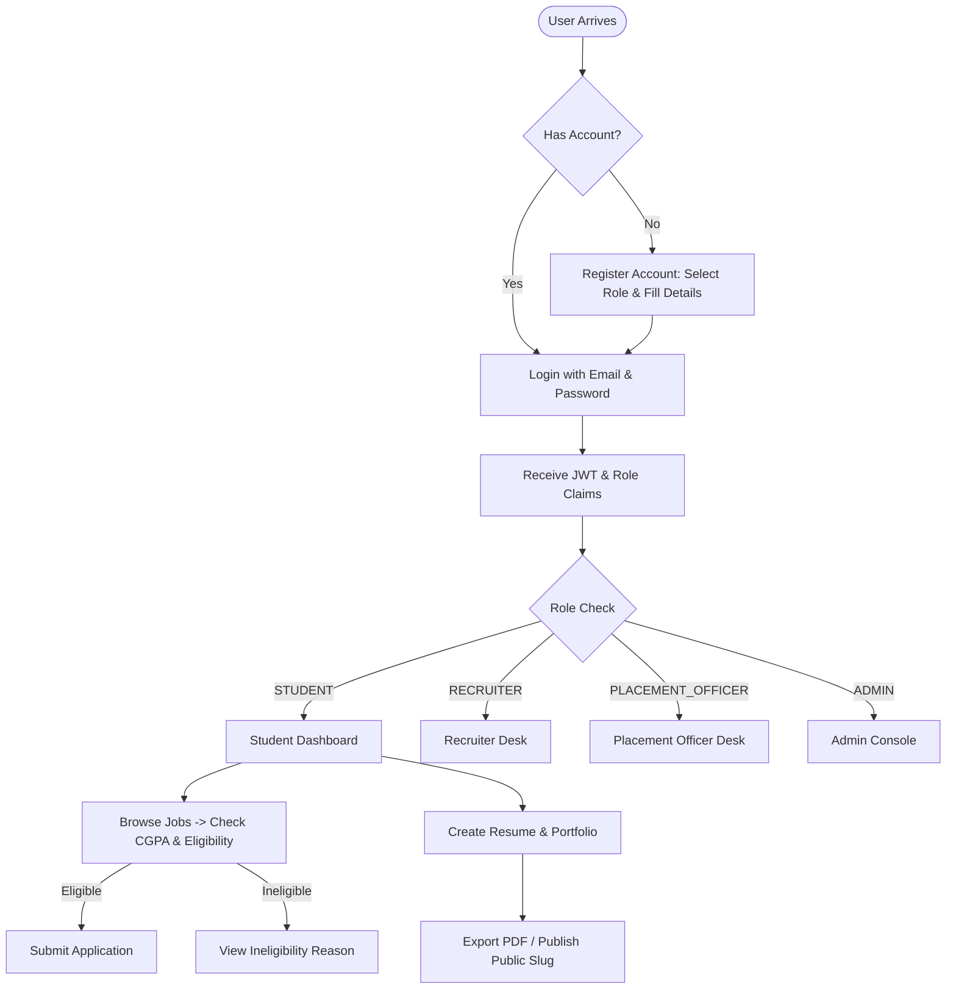
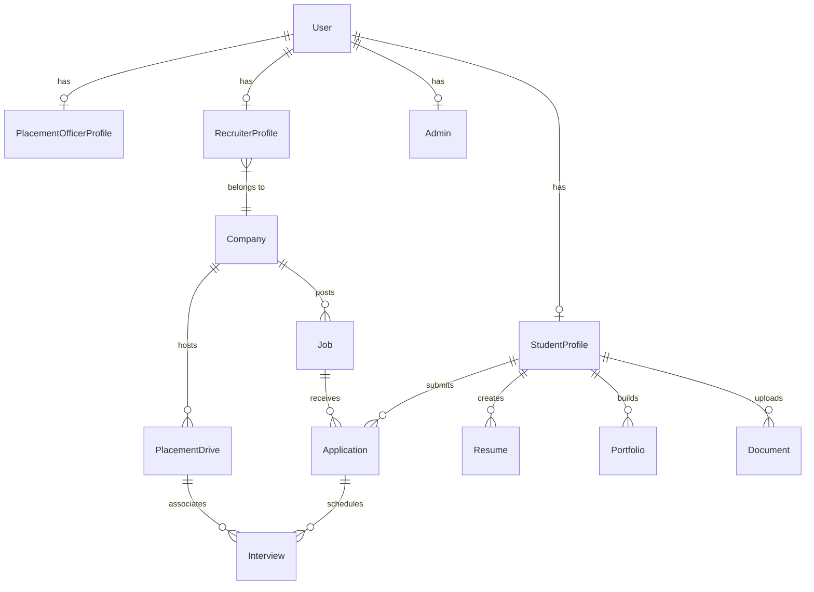

# Placement Management Portal (PlaceHub) — Full Project Documentation

An enterprise-grade, full-stack **Campus Recruitment & Placement Management Platform** built with **React 18, Vite, TypeScript, Node.js, Express.js, Prisma ORM, and PostgreSQL**.

---

## 1. Hackathon Roadmap & Image Analysis

This section analyzes the Day-1 Implementation Roadmap specified in the project requirements image:

```
+---------------------------------------------------------------------------------------------------------+
| Day-1 Implementation Roadmap                                                                            |
+---------+-----------------------------------------+-----------------------------------------------------+
| Phase   | Objectives                              | Implementation Breakdown                            |
+---------+-----------------------------------------+-----------------------------------------------------+
| Phase 1 | Problem Understanding & Solution        | - Problem Statement Analysis                        |
|         | Analysis                                | - Target Users Identification                       |
|         |                                         | - Major Problems List                               |
|         |                                         | - Proposed Solution Definition                      |
|         |                                         | - Core Features Outline                             |
|         |                                         | - Tech Stack Selection (React, Node)                |
+---------+-----------------------------------------+-----------------------------------------------------+
| Phase 2 | System Design & Architecture            | - User Flow Mapping                                 |
|         |                                         | - Wireframes & UI Sketching                         |
|         |                                         | - Database Design (ER Diagram)                      |
|         |                                         | - API Planning                                      |
|         |                                         | - Project Folder Structure                          |
+---------+-----------------------------------------+-----------------------------------------------------+
| Phase 3 | Frontend Development                    | - Authentication Pages (Login/Register)             |
|         |                                         | - Dashboard Layouts                                 |
|         |                                         | - Responsive Navigation & Layout                    |
|         |                                         | - Interactive Forms & Modals                        |
|         |                                         | - Basic & Advanced API Integration                  |
+---------+-----------------------------------------+-----------------------------------------------------+
```

---

## 2. Phase 1: Problem Understanding & Solution Analysis

### 2.1 Problem Statement
In traditional university placement setups, recruitment processes suffer from:
1. **Manual Eligibility Verification**: Placement officers manually verify CGPA, backlogs, and department criteria, leading to bottlenecks and human errors.
2. **Scattered Applicant Information**: Resumes and portfolios exist in isolated formats (PDFs, drive links), making shortlisting tedious for corporate recruiters.
3. **Lack of Live Interview Tracking**: Coordinating multiple interview rounds across various visiting companies causes scheduling conflicts and delayed updates.
4. **Poor Student Showcase**: Students lack an easy tool to generate ATS-friendly resumes and shareable web portfolios.

### 2.2 Target Users
1. **Students**: Apply for eligible jobs, track application statuses, build resumes, and publish custom web portfolios.
2. **Corporate Recruiters**: Post job openings, review applicant profiles and resumes, shortlist candidates, and manage interview outcomes.
3. **Placement Officers**: Verify student profiles, host campus drives, schedule interviews, and analyze recruitment statistics.
4. **System Administrators**: Oversee users, audit system activities, approve company accounts, and manage system-wide settings.

### 2.3 Key Features & Core Solution
- **Automated Eligibility Engine**: Automatically cross-references student CGPA and department against job criteria before application submission.
- **Dynamic Resume & Web Portfolio Builder**: Generates responsive, customizable public web portfolios and printable ATS-compliant resumes.
- **Live Interview Desk**: Placement officers and recruiters can manage, reschedule, and track multi-round interviews in real-time.
- **Role-Based Security & Access Control**: Enforces strict endpoint and UI authorization across 4 distinct user roles (`STUDENT`, `RECRUITER`, `PLACEMENT_OFFICER`, `ADMIN`).

---

## 3. Tech Stack & Dependencies

### 3.1 Frontend Stack
- **Core**: React 18, TypeScript, Vite
- **Styling & Aesthetics**: Vanilla CSS Design Tokens, Tailwind CSS, Glassmorphism UI
- **State Management**: Zustand (Global Auth State, Toast System)
- **Data Fetching & Caching**: TanStack React Query v5
- **Routing**: React Router DOM v6 (Protected Route Guards)
- **UI Icons**: Lucide React
- **Document Export & Generation**: `html2pdf.js`, `React-to-Print`
- **Charts & Data Visuals**: Recharts

### 3.2 Backend Stack
- **Runtime & Server Framework**: Node.js v18+, Express.js, TypeScript
- **Database & ORM**: PostgreSQL database managed via Prisma ORM v5
- **Authentication & Security**: JSON Web Tokens (JWT), `bcryptjs` password hashing, HTTP Bearer Authorization
- **Input Validation**: Zod schema validation middleware
- **Architecture Pattern**: Controller-Service-Repository modular architecture

---

## 4. Phase 2: System Design & Architecture

### 4.1 Project Folder Structure

```
Placement-Portal/
├── backend/
│   ├── prisma/
│   │   └── schema.prisma           # Prisma ER schema definition
│   ├── src/
│   │   ├── config/                 # Environment & Prisma client setup
│   │   ├── controllers/            # Request handlers (Auth, Jobs, Students, etc.)
│   │   ├── middleware/             # Auth JWT, Role Guards, Error Handlers
│   │   ├── routes/                 # Express API routes
│   │   ├── services/               # Business logic & Database queries
│   │   ├── utils/                  # Token generation, helpers
│   │   └── app.ts                  # Express application setup
│   └── package.json
└── frontend/
    ├── src/
    │   ├── app/                    # Router configuration & providers
    │   ├── components/             # Reusable UI components & Layouts
    │   ├── features/               # Feature modules (auth, student, placement, jobs, etc.)
    │   ├── hooks/                  # Custom React hooks
    │   ├── store/                  # Zustand global stores
    │   └── styles/                 # CSS Design Tokens & themes
    └── package.json
```

### 4.2 User Flow Diagram



### 4.3 Database ER Diagram



---

## 5. Complete API Reference

### 5.1 Authentication Module (`/api/auth`)
| Method | Endpoint | Authorization | Description |
| :--- | :--- | :--- | :--- |
| `POST` | `/api/auth/register` | Public | Register a new user (Student, Recruiter, Officer, Admin) |
| `POST` | `/api/auth/login` | Public | Authenticate credentials and return JWT bearer token |
| `GET` | `/api/auth/me` | Bearer JWT | Fetch authenticated user details and profile |

### 5.2 Jobs & Eligibility Module (`/api/jobs`)
| Method | Endpoint | Authorization | Description |
| :--- | :--- | :--- | :--- |
| `GET` | `/api/jobs/public` | Bearer JWT (`STUDENT`) | List all active job postings |
| `GET` | `/api/jobs/public/:id` | Bearer JWT | Get detailed job posting by ID |
| `GET` | `/api/jobs/eligibility/:id` | Bearer JWT (`STUDENT`) | Evaluate CGPA, department, and backlog criteria for a job |
| `POST` | `/api/jobs/apply/:id` | Bearer JWT (`STUDENT`) | Submit job application upon passing eligibility check |
| `GET` | `/api/jobs/recruiter` | Bearer JWT (`RECRUITER`) | Fetch jobs posted by the recruiter's company |
| `POST` | `/api/jobs` | Bearer JWT (`RECRUITER`) | Post a new job opportunity |
| `PUT` | `/api/jobs/:id` | Bearer JWT (`RECRUITER`) | Update job details or status (`OPEN`, `CLOSED`, `FILLED`) |
| `DELETE` | `/api/jobs/:id` | Bearer JWT (`RECRUITER`) | Remove job posting |

### 5.3 Student Profiles & Applications (`/api/students`, `/api/applications`)
| Method | Endpoint | Authorization | Description |
| :--- | :--- | :--- | :--- |
| `GET` | `/api/students/profile` | Bearer JWT (`STUDENT`) | Retrieve complete student profile with education & skills |
| `PUT` | `/api/students/profile` | Bearer JWT (`STUDENT`) | Update profile details (phone, bio, social links) |
| `POST` | `/api/students/education` | Bearer JWT (`STUDENT`) | Add education record |
| `POST` | `/api/students/projects` | Bearer JWT (`STUDENT`) | Add technical project record |
| `POST` | `/api/students/skills` | Bearer JWT (`STUDENT`) | Add skill entry |
| `GET` | `/api/applications/my-applications` | Bearer JWT (`STUDENT`) | List student's active applications and status updates |

### 5.4 Placement Officer Desk (`/api/placement`)
| Method | Endpoint | Authorization | Description |
| :--- | :--- | :--- | :--- |
| `GET` | `/api/placement/dashboard` | Bearer JWT (`OFFICER`) | Overview recruitment analytics & stats |
| `GET` | `/api/placement/students` | Bearer JWT (`OFFICER`) | List student profiles for verification |
| `PUT` | `/api/placement/students/:id/verify` | Bearer JWT (`OFFICER`) | Update student verification status (`VERIFIED`, `REJECTED`) |
| `GET` | `/api/placement/interviews` | Bearer JWT (`OFFICER`) | Retrieve scheduled interviews across drives |
| `POST` | `/api/placement/interviews` | Bearer JWT (`OFFICER`) | Schedule a new interview round |

---

## 6. Phase 3: Prototype Screenshots Showcase

Below are the live functional screenshots captured directly from the running web application:

### 6.1 Authentication Pages

*Figure 6.1a: Secure Login Page supporting role-based credentials.*


*Figure 6.1b: Registration Portal with dynamic role selection and academic profile inputs.*

---

### 6.2 Student Dashboard & Profile Workspace

*Figure 6.2a: Student Dashboard featuring Placement Readiness score tracker and quick action cards.*


*Figure 6.2b: Academic Profile Management with Education, Skills, and Social Link editors.*

---

### 6.3 Resume & Public Web Portfolio Builders

*Figure 6.3a: Interactive Resume Builder with automatic PDF compilation and template selection.*


*Figure 6.3b: Portfolio Generator Workspace with theme customization and custom URL slug assignment.*


*Figure 6.3c: Live Public Portfolio View (`/portfolio/public/:slug`) showcasing published candidate details.*

---

### 6.4 Job Exploration & Application Tracking

*Figure 6.4a: Job Exploration Desk with instant search, location filters, and salary range details.*


*Figure 6.4b: Automated Eligibility Modal validating CGPA and backlog criteria prior to application.*


*Figure 6.4c: Real-time Application Tracking Desk displaying submitted job applications and status badges.*

---

## 7. Setup & Local Development Guide

### Prerequisites
- **Node.js**: v18.0.0+
- **PostgreSQL**: Running instance or Supabase URI string

### 7.1 Backend Execution
```bash
cd backend
npm install
npx prisma generate
npx prisma db push
npm run dev
```
*Backend API runs at `http://localhost:5000`*

### 7.2 Frontend Execution
```bash
cd frontend
npm install
npm run dev
```
*Frontend App runs at `http://localhost:5173`*

### 7.3 Chrome Extension Setup
```bash
cd extension
npm install
npm run build
```
*In Chrome (`chrome://extensions`), enable "Developer mode", click **Load unpacked**, and select the `extension/dist` directory.*

---
