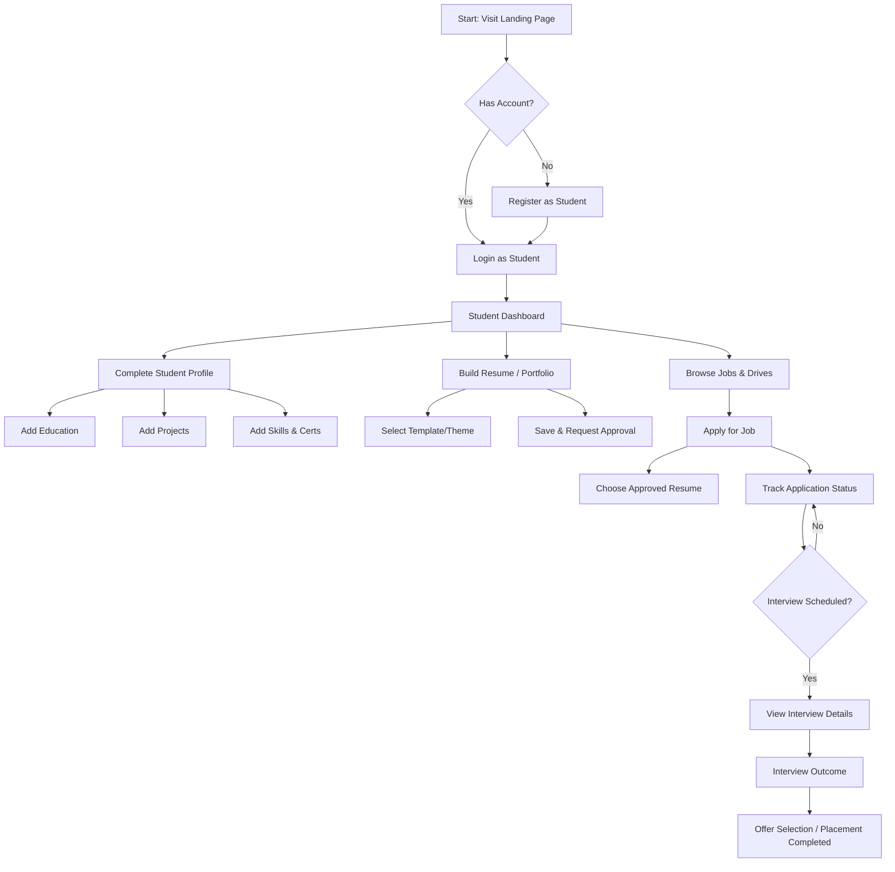
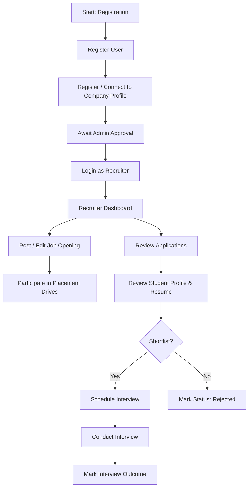
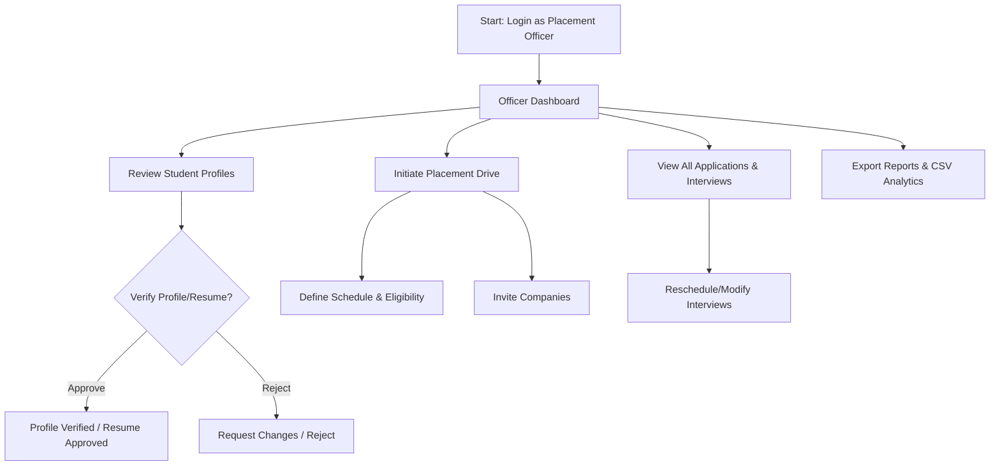
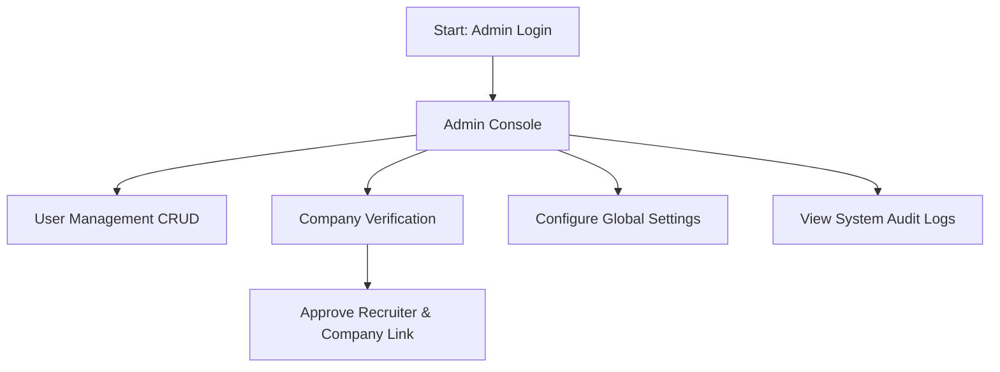
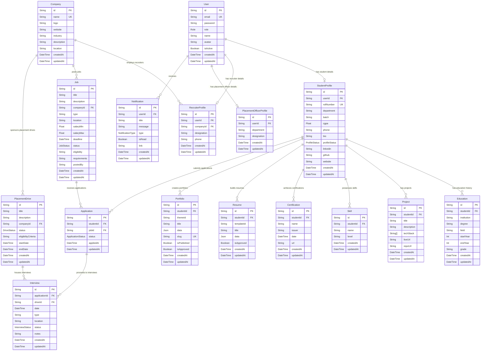

# Placement Management Portal — Architecture & Design Blueprint

This blueprint outlines the detailed user flow, database entity-relationship (ER) model, API routes, project folder structure, and wireframe layouts for the **Placement Management Portal**.

---

## 1. User Flows

The system supports four distinct user roles, each with specific journeys:

### 1.1 Student Journey


### 1.2 Recruiter Journey


### 1.3 Placement Officer Journey


### 1.4 Admin Journey


---

## 2. Database ER Diagram

Below is the database entity model generated from the Prisma database schema. It shows the tables, fields, types, constraints, and relationships.



---

## 3. API Planning

The backend routes are designed modularly. All routes under `/api/*` except public ones require a valid JWT header (`Authorization: Bearer <token>`).

### 3.1 Authentication & User Routes (`/api/auth`, `/api/user`)
| Method | Endpoint | Auth | Role | Description |
| :--- | :--- | :--- | :--- | :--- |
| **POST** | `/api/auth/register` | Public | All | Register a new user + profile shell |
| **POST** | `/api/auth/login` | Public | All | Authenticate and return JWT token |
| **GET** | `/api/auth/me` | JWT | All | Get current user's profile and details |
| **POST** | `/api/auth/change-password` | JWT | All | Change password |
| **GET** | `/api/user/notifications` | JWT | All | Retrieve user-specific notifications |
| **PUT** | `/api/user/notifications/:id/read` | JWT | All | Mark single notification as read |
| **PUT** | `/api/user/notifications/read-all` | JWT | All | Mark all notifications as read |

### 3.2 Student Profile Routes (`/api/students`)
| Method | Endpoint | Auth | Role | Description |
| :--- | :--- | :--- | :--- | :--- |
| **GET** | `/api/students/profile` | JWT | Student / Admin / Officer | Get student profile |
| **PUT** | `/api/students/profile` | JWT | Student | Update student profile settings |
| **POST** | `/api/students/education` | JWT | Student | Add education detail |
| **PUT** | `/api/students/education/:id` | JWT | Student | Update education detail |
| **DELETE** | `/api/students/education/:id` | JWT | Student | Delete education detail |
| **POST** | `/api/students/projects` | JWT | Student | Add project |
| **PUT** | `/api/students/projects/:id` | JWT | Student | Update project |
| **DELETE** | `/api/students/projects/:id` | JWT | Student | Delete project |
| **POST** | `/api/students/skills` | JWT | Student | Add skill |
| **DELETE** | `/api/students/skills/:id` | JWT | Student | Remove skill |
| **POST** | `/api/students/certifications` | JWT | Student | Add certification |
| **PUT** | `/api/students/certifications/:id` | JWT | Student | Update certification |
| **DELETE** | `/api/students/certifications/:id` | JWT | Student | Delete certification |

### 3.3 Recruiter & Company Routes (`/api/recruiters`, `/api/companies`)
| Method | Endpoint | Auth | Role | Description |
| :--- | :--- | :--- | :--- | :--- |
| **GET** | `/api/recruiters/profile` | JWT | Recruiter | Get recruiter details |
| **PUT** | `/api/recruiters/profile` | JWT | Recruiter | Update recruiter profile details |
| **GET** | `/api/recruiters/company` | JWT | Recruiter | Get linked company details |
| **GET** | `/api/recruiters/applicants` | JWT | Recruiter | Query applicants for their jobs |
| **PUT** | `/api/recruiters/applicants/:id/status` | JWT | Recruiter | Update applicant status (Shortlisted, etc.) |
| **GET** | `/api/companies` | JWT | All | List companies |
| **POST** | `/api/companies` | JWT | Recruiter / Admin / Officer | Register a new company |
| **PUT** | `/api/companies/:id` | JWT | Recruiter / Admin / Officer | Update company details |

### 3.4 Jobs & Applications Routes (`/api/jobs`, `/api/applications`)
| Method | Endpoint | Auth | Role | Description |
| :--- | :--- | :--- | :--- | :--- |
| **GET** | `/api/jobs` | JWT | All | List active job listings (supports query filters) |
| **GET** | `/api/jobs/:id` | JWT | All | Get detailed job specs |
| **POST** | `/api/jobs` | JWT | Recruiter / Officer | Create a new job listing |
| **PUT** | `/api/jobs/:id` | JWT | Recruiter / Officer | Update job details |
| **DELETE** | `/api/jobs/:id` | JWT | Recruiter / Officer | Delete/Archive job |
| **GET** | `/api/applications` | JWT | Student / Recruiter / Officer | View applications (filtered by permission role) |
| **POST** | `/api/applications` | JWT | Student | Apply to a job listing (requires an approved resume) |
| **GET** | `/api/applications/:id` | JWT | All | View application progress and details |
| **PUT** | `/api/applications/:id/status` | JWT | Recruiter / Officer | Transition status (Applied -> Shortlisted, etc.) |

### 3.5 Placement Drives & Interviews (`/api/placement-drives`, `/api/interviews`)
| Method | Endpoint | Auth | Role | Description |
| :--- | :--- | :--- | :--- | :--- |
| **GET** | `/api/placement-drives` | JWT | All | View upcoming/ongoing/completed placement drives |
| **POST** | `/api/placement-drives` | JWT | Officer | Create a placement drive |
| **PUT** | `/api/placement-drives/:id` | JWT | Officer | Update drive status or criteria |
| **DELETE** | `/api/placement-drives/:id` | JWT | Officer | Cancel or complete placement drive |
| **GET** | `/api/interviews` | JWT | All | List scheduled interviews |
| **POST** | `/api/interviews` | JWT | Recruiter / Officer | Schedule interview for an application |
| **PUT** | `/api/interviews/:id` | JWT | Recruiter / Officer | Update interview details or status (Completed/Cancelled) |

### 3.6 Resumes & Portfolios (`/api/resumes`, `/api/portfolios`)
| Method | Endpoint | Auth | Role | Description |
| :--- | :--- | :--- | :--- | :--- |
| **GET** | `/api/resumes` | JWT | Student | List student's own resumes |
| **POST** | `/api/resumes` | JWT | Student | Save a new resume configuration template |
| **GET** | `/api/resumes/:id` | JWT | All (Authenticated) | Get resume content (PDF export / viewer) |
| **PUT** | `/api/resumes/:id` | JWT | Student | Update resume content |
| **DELETE** | `/api/resumes/:id` | JWT | Student | Delete a resume |
| **GET** | `/api/portfolios` | JWT | Student | List student's portfolios |
| **POST** | `/api/portfolios` | JWT | Student | Create a portfolio config slug |
| **GET** | `/portfolios/public/:slug` | Public | Public | Render a student's public web portfolio |
| **PUT** | `/api/portfolios/:id` | JWT | Student | Edit portfolio details / Publish |
| **DELETE** | `/api/portfolios/:id` | JWT | Student | Delete portfolio |

### 3.7 Placement Officer Actions & Analytics (`/api/placement`, `/api/analytics`)
| Method | Endpoint | Auth | Role | Description |
| :--- | :--- | :--- | :--- | :--- |
| **GET** | `/api/placement/students` | JWT | Officer / Admin | List all students with verify filters |
| **PUT** | `/api/placement/students/:id/status` | JWT | Officer / Admin | Verify/reject student profiles |
| **PUT** | `/api/placement/resumes/:id/approve` | JWT | Officer | Approve/reject resume for jobs |
| **PUT** | `/api/placement/portfolios/:id/approve` | JWT | Officer | Approve/reject portfolio |
| **GET** | `/api/analytics/officer` | JWT | Officer | Aggregated placement rates, dept wise distribution |
| **GET** | `/api/analytics/recruiter` | JWT | Recruiter | Hire rate statistics |

---

## 4. Project Folder Structure

The project implements a feature-modular organization which ensures codebase scalability:

```
├── frontend/                     # React Client App (Vite + TS)
│   ├── public/                   # Public assets
│   ├── src/
│   │   ├── app/                  # Application initialization
│   │   │   ├── App.tsx           # Entry React Component
│   │   │   ├── main.tsx          # DOM Mounting point
│   │   │   ├── providers.tsx     # Context Providers (Query, Auth, Theme)
│   │   │   └── router.tsx        # React Router configuration
│   │   ├── components/           # Shared reusable atomic UI components
│   │   │   ├── ui/               # Radix UI components (shadcn/ui templates)
│   │   │   └── layout/           # Shared layouts (Navbar, Sidebar, Footer)
│   │   ├── features/             # Feature modules (self-contained modules)
│   │   │   ├── auth/             # Login, register, auth hooks, state
│   │   │   ├── admin/            # Admin console, user verification
│   │   │   ├── placement-officer/# Verification panel, report generation
│   │   │   ├── recruiter/        # Recruiter portal, job management
│   │   │   ├── student/          # Student profile management
│   │   │   ├── resume-builder/   # Custom resume template generator
│   │   │   ├── portfolio-generator/# Static portfolio editor & previews
│   │   │   ├── jobs/             # Job board list, cards, filter logic
│   │   │   ├── applications/     # Application status trackers
│   │   │   ├── placement-drives/ # Active placement drives grid
│   │   │   ├── notifications/    # User notification popovers/pages
│   │   │   └── analytics/        # Recharts interactive dashboard
│   │   ├── hooks/                # Global generic React hooks
│   │   ├── lib/                  # Library configurations (Axios clients, Utils)
│   │   ├── routes/               # Navigation paths & Router protection guards
│   │   ├── store/                # Global state stores (Zustand state)
│   │   ├── styles/               # Global Tailwind CSS configurations & themes
│   │   └── types/                # Global typescript schemas
│   ├── package.json              # Client packages configuration
│   ├── tailwind.config.js        # Tailwind layout theme configuration
│   └── tsconfig.json             # TypeScript compiler rules
│
├── backend/                      # Node.js + Express API Server
│   ├── prisma/                   # ORM Configurations
│   │   ├── schema.prisma         # PostgreSQL DB Entity Schemas
│   │   └── seed.ts               # Local DB seeder
│   ├── src/
│   │   ├── config/               # Database pool, Environment keys, and Consts
│   │   ├── middleware/           # Middleware controllers
│   │   │   ├── auth.middleware.ts# Token validator
│   │   │   ├── role.middleware.ts# Role authorization check
│   │   │   ├── error.middleware.ts# Global error handlers
│   │   │   └── validate.middleware.ts# Request validator (Zod)
│   │   ├── modules/              # Subdivided logic components
│   │   │   ├── auth/             # Authentication handlers (login/register)
│   │   │   ├── student/          # Student profile operations
│   │   │   ├── recruiter/        # Recruiter workflow handlers
│   │   │   ├── job/              # Job posting CRUD operations
│   │   │   ├── application/      # Apply & track handlers
│   │   │   └── ...               # (All modular folders have *.controller.ts,
│   │   │                         #  *.routes.ts, *.service.ts, *.schema.ts)
│   │   ├── utils/                # Standardized helper scripts
│   │   └── index.ts              # Express initialization
│   ├── package.json              # Server packages configuration
│   └── tsconfig.json             # TypeScript compiler settings
```

---

## 5. UI Wireframes

Here are standard layout blueprints for key modules.

### 5.1 Student Dashboard Wireframe
```
+-------------------------------------------------------------------------------+
|  PLACEMENT PORTAL (Student)                      [Bell Icon] [Avatar dropdown]|
+-------------------------------------------------------------------------------+
|  [Sidebar]    |  WELCOME BACK, JOHN DOE                                       |
|  - Dashboard  |  Status: [ VERIFIED ]            CGPA: [ 9.12 / 10 ]          |
|  - Profile    |  +---------------------------------------------------------+  |
|  - Resumes    |  | Ongoing Placement Drives (2)                            |  |
|  - Portfolios |  | - Google Summer Drive (Starts Aug 10)  [View Info]      |  |
|  - Jobs       |  | - Stripe Recruitment (Ongoing)         [Apply Now]      |  |
|  - Interviews |  +---------------------------------------------------------+  |
|               |                                                               |
|               |  +---------------------------+ +----------------------------+ |
|               |  | Recent Job Applications   | | Upcoming Interviews        | |
|               |  | - Netflix [Shortlisted]   | | - Microsoft Tech Round     | |
|               |  | - Meta    [Interviewing]  | |   Aug 4, 10:00 AM (Online) | |
|               |  | - Amazon  [Applied]       | |   [Join Meet Link]         | |
|               |  +---------------------------+ +----------------------------+ |
+-------------------------------------------------------------------------------+
```

### 5.2 Resume Builder Wireframe
```
+-------------------------------------------------------------------------------+
|  RESUME BUILDER -- "My Tech CV 2026"                 [Save Draft] [Request Verification]|
+-------------------------------------------------------------------------------+
|  [Select Template]   |  [LIVE PREVIEW] (Updates dynamically)                  |
|  ( ) Elegant Classic |  +--------------------------------------------------+  |
|  (*) Modern Tech     |  | JOHN DOE                                         |  |
|  ( ) Minimalist      |  | Email: john.doe@email.com | Tel: 123456789       |  |
|                      |  | ------------------------------------------------ |  |
|  [Sections Editor]   |  | EDUCATION                                        |  |
|  > Personal Info     |  | B.Tech in CSE - Grade: 9.12 CGPA                 |  |
|  > Education         |  | ------------------------------------------------ |  |
|  > Work Experience   |  | PROJECTS                                         |  |
|  > Projects          |  | - Placement Portal (React, Express, Postgres)    |  |
|  > Skills & Certs    |  |   Built a full campus placement system.          |  |
|                      |  +--------------------------------------------------+  |
+-------------------------------------------------------------------------------+
```

### 5.3 Placement Officer Dashboard Wireframe
```
+-------------------------------------------------------------------------------+
|  PLACEMENT OFFICER CONSOLE                       [Notifications] [Profile Log]|
+-------------------------------------------------------------------------------+
|  [Sidebar]    |  PLACEMENT ANALYTICS & HUB OVERVIEW                           |
|  - Home       |  +------------------+ +------------------+ +------------------+ |
|  - Students   |  | Verified Profiles| | Active Drives    | | Placement Rate   | |
|  - Resumes    |  |      412 / 450   | |       8          | |       82%        | |
|  - Drives     |  +------------------+ +------------------+ +------------------+ |
|  - Companies  |                                                               |
|  - Analytics  |  +---------------------------------------------------------+  |
|               |  | Action Required (Pending Approvals)                     |  |
|               |  | - Jane Smith: Submitted Resume "ML Resume"   [Approve] [Reject]|  |
|               |  | - Bob Miller: Updated Profile CGPA to 8.7   [Approve] [Reject]|  |
|               |  +---------------------------------------------------------+  |
|               |                                                               |
|               |  +---------------------------------------------------------+  |
|               |  | Active Placement Drives                                 |  |
|               |  | - Microsoft (12 Applied) [Manage] | - Amazon (24 Applied) [Manage]|
|               |  +---------------------------------------------------------+  |
+-------------------------------------------------------------------------------+
```

### 5.4 Job Board & Filter Wireframe
```
+-------------------------------------------------------------------------------+
|  PLACEMENT JOBS BOARD                                             [Search jobs...]|
+-------------------------------------------------------------------------------+
|  [FILTERS]       |  JOBS SEARCH RESULTS (Showing 14 active listings)          |
|                  |                                                            |
|  Type            |  +-------------------------------------------------------+ |
|  [x] Full-time   |  | Software Engineer (Backend)                 [OPEN]    | |
|  [ ] Internship  |  | Stripe Inc. | Location: Remote/Hybrid                 | |
|  [ ] Contract    |  | CTC: $120,000 - $140,000 | Deadline: Aug 15           | |
|                  |  | Eligibility: CGPA >= 8.0, CSE/IT Department           | |
|  Department      |  | [View Details]                          [Apply Now]   | |
|  [x] CSE / IT    |  +-------------------------------------------------------+ |
|  [ ] ECE         |  +-------------------------------------------------------+ |
|  [ ] ME          |  | Systems Analyst                             [OPEN]    | |
|                  |  | Deloitte | Location: New York (Onsite)                 | |
|  Min Salary      |  | CTC: $90,000 - $110,000 | Deadline: Aug 12            | |
|  [ $100k+   ]    |  | [View Details]                          [Apply Now]   | |
|                  |  +-------------------------------------------------------+ |
+-------------------------------------------------------------------------------+
```
