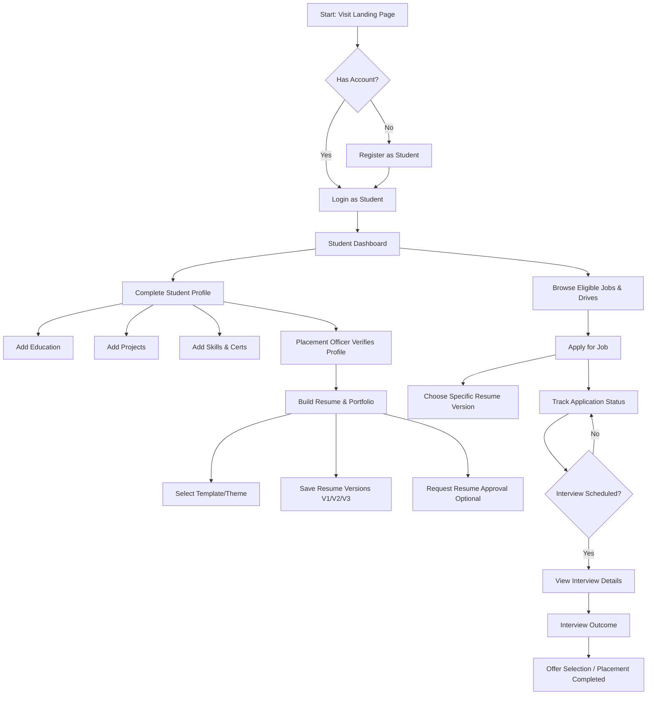
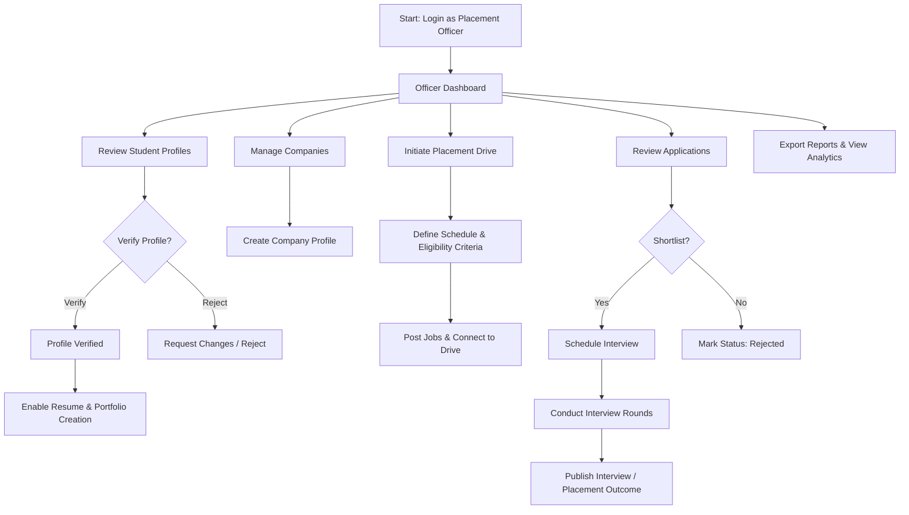
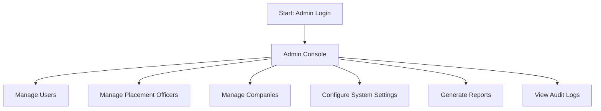
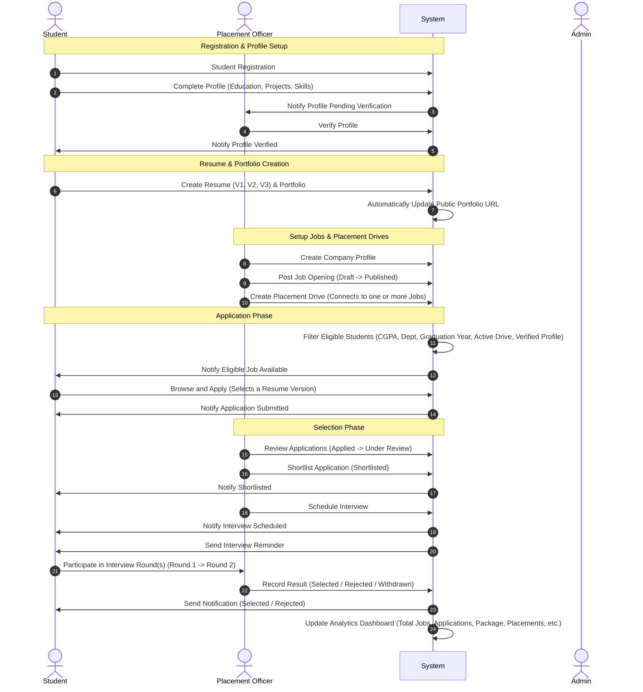
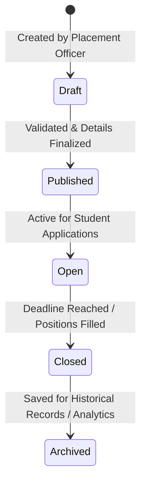
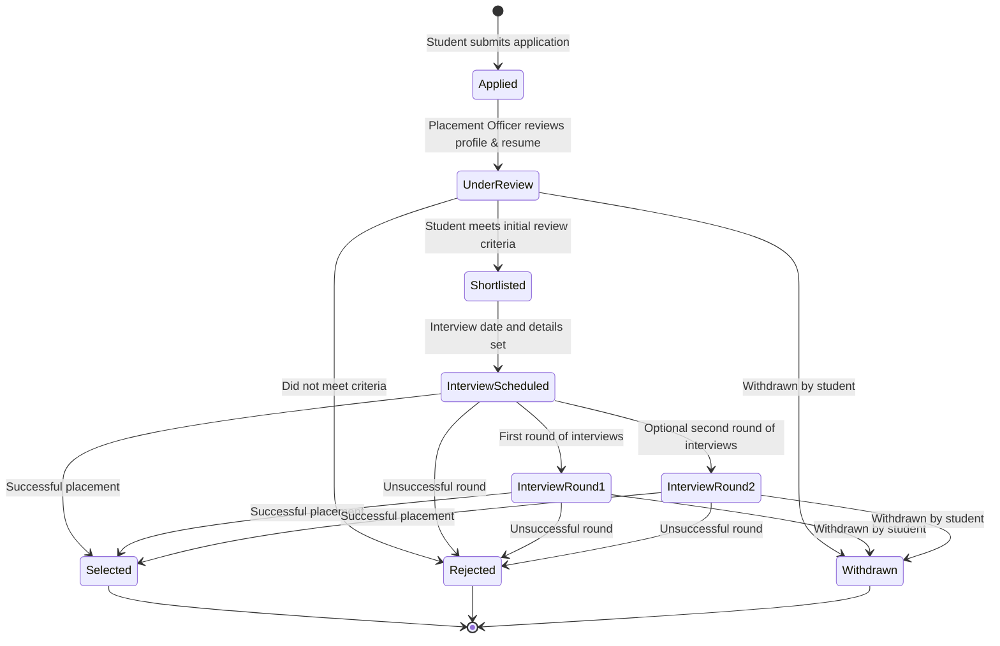
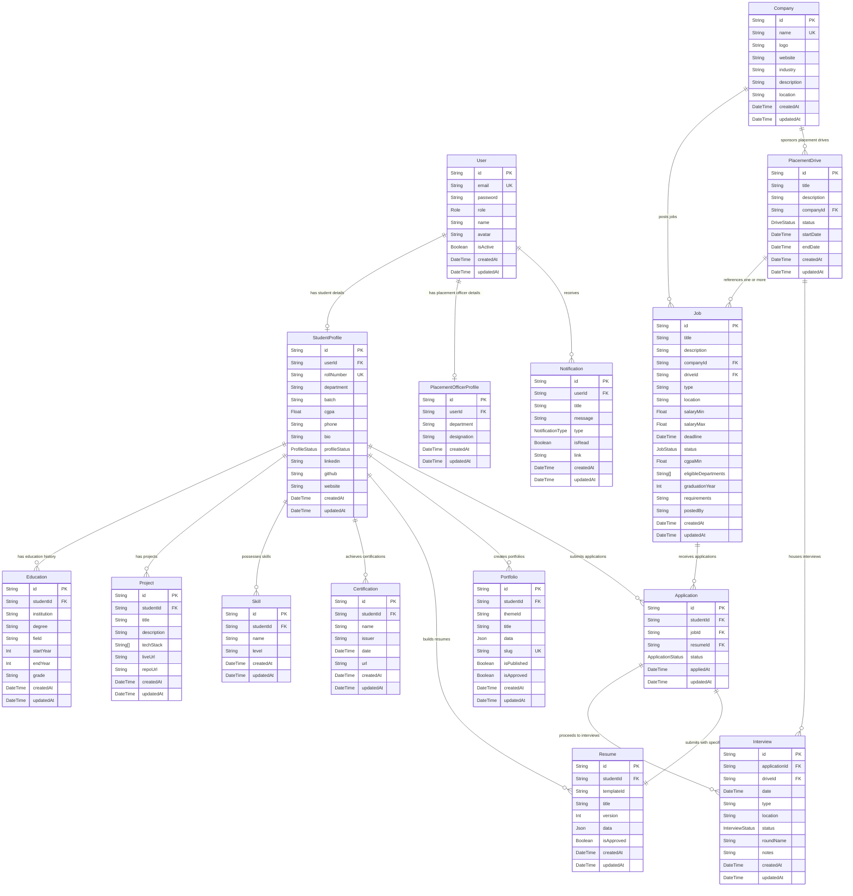

# Placement Management Portal — Architecture & Design Blueprint

This blueprint outlines the system architecture, user journeys, lifecycles, database entity-relationship (ER) model, API routes, project folder structure, and wireframe layouts for the **Placement Management Portal**.

---

## 1. System Architecture

The Placement Management Portal is organized into the following logical modules:

*   **Authentication Module:** Handles secure signup, login, and JWT-based session and role management for the three system roles: **Student**, **Placement Officer**, and **Admin**.
*   **Student Module:** Empowers students to complete profiles, build and version resumes, view public portfolio links, search and filter eligible jobs, and submit applications.
*   **Placement Officer Module:** Allows officers to verify student profiles/resumes, register companies, post jobs, coordinate placement drives, schedule interviews, and publish results on behalf of companies.
*   **Admin Module:** Manages system configurations, logs, users, and reports.
*   **Resume Builder:** Features template selection and content editing to compile and track multiple versions of student resumes.
*   **Portfolio Generator:** Automatically updates a public portfolio web page based on the student's verified profile data.
*   **Notifications Engine:** Dispatches alerts across key lifecycle triggers.
*   **Analytics Dashboard:** Synthesizes platform metrics into interactive visualizations.

> [!NOTE]
> **Company Participation:** Companies do not directly access the portal. Placement Officers coordinate with companies through external communication channels (e.g., email, phone) and update the portal on behalf of the companies.

---

## 2. User Flows & Journeys

The system supports three distinct user roles, each with specific journeys:

### 2.1 Student Journey


### 2.2 Placement Officer Journey


### 2.3 Admin Journey


---

## 3. Workflows & Lifecycles

### 3.1 Complete System Lifecycle Sequence Diagram


### 3.2 Job Lifecycle
Jobs transition through distinct phases managed by the Placement Officer:


### 3.3 Application Lifecycle
An application moves through the following states during the evaluation process:


### 3.4 Portfolio Generator Integration Workflow
The portfolio generator stays in sync with student profile updates:
1.  **Student Updates Profile:** Editing education, projects, skills, or certifications.
2.  **Portfolio Automatically Updates:** Background handler synchronizes data changes with the Portfolio content.
3.  **Public Portfolio URL Generated:** A unique slug-based URL (e.g., `/portfolios/public/john-doe`) is exposed.
4.  **External Sharing:** The Placement Officer copies and shares this link with external company stakeholders.

### 3.5 Automatic Eligibility Filtering
The system enforces guardrails so students only view and apply to eligible jobs. The matching engine evaluates:
*   **Verified Profile:** The student profile must have the status `VERIFIED` by a Placement Officer.
*   **Active Placement Drive:** The job must be associated with an active, ongoing placement drive.
*   **CGPA:** The student's current CGPA must be greater than or equal to the job's minimum CGPA requirements.
*   **Department:** The student's department must match the eligible departments listed for the job.
*   **Graduation Year:** The student's batch year must align with the job's target graduation year.

### 3.6 Resume Versioning
To allow tailoring applications for specific roles:
*   Students can create and maintain multiple resume variations (e.g., **Resume V1** for Backend, **Resume V2** for Frontend, **Resume V3** for Data Science).
*   During application submission, the student explicitly selects one resume version to attach.

---

## 4. Database ER Diagram

Below is the database entity model generated from the Prisma database schema. It shows the tables, fields, types, constraints, and relationships.



---

## 5. API Planning

The backend routes are designed modularly. All routes under `/api/*` except public ones require a valid JWT header (`Authorization: Bearer <token>`).

### 5.1 Authentication & User Routes (`/api/auth`, `/api/user`)
| Method | Endpoint | Auth | Role | Description |
| :--- | :--- | :--- | :--- | :--- |
| **POST** | `/api/auth/register` | Public | All | Register a new user + profile shell |
| **POST** | `/api/auth/login` | Public | All | Authenticate and return JWT token |
| **GET** | `/api/auth/me` | JWT | All | Get current user's profile and details |
| **POST** | `/api/auth/change-password` | JWT | All | Change password |
| **GET** | `/api/user/notifications` | JWT | All | Retrieve user-specific notifications |
| **PUT** | `/api/user/notifications/:id/read` | JWT | All | Mark single notification as read |
| **PUT** | `/api/user/notifications/read-all` | JWT | All | Mark all notifications as read |

### 5.2 Student Profile Routes (`/api/students`)
| Method | Endpoint | Auth | Role | Description |
| :--- | :--- | :--- | :--- | :--- |
| **GET** | `/api/students/profile` | JWT | Student / Admin / Officer | Get student profile |
| **PUT** | `/api/students/profile` | JWT | Student | Update student profile settings |
| **POST** | `/api/students/education` | JWT | Student | Add education detail |
| **PUT** | `/api/students/education/:id` | JWT | Student | Update education detail |
| **DELETE** | `/api/students/education/:id` | JWT | Student | Delete education detail |
| **POST** | `/api/students/projects` | JWT | Student | Add project |
| **PUT** | `/api/students/projects/:id` | JWT | Student | Update project |
| **DELETE** | `/api/students/projects/:id` | JWT | Student | Delete project |
| **POST** | `/api/students/skills` | JWT | Student | Add skill |
| **DELETE** | `/api/students/skills/:id` | JWT | Student | Remove skill |
| **POST** | `/api/students/certifications` | JWT | Student | Add certification |
| **PUT** | `/api/students/certifications/:id` | JWT | Student | Update certification |
| **DELETE** | `/api/students/certifications/:id` | JWT | Student | Delete certification |

### 5.3 Company Routes (`/api/companies`)
| Method | Endpoint | Auth | Role | Description |
| :--- | :--- | :--- | :--- | :--- |
| **GET** | `/api/companies` | JWT | All | List companies |
| **POST** | `/api/companies` | JWT | Officer / Admin | Register a new company (Officer coordinates externally) |
| **PUT** | `/api/companies/:id` | JWT | Officer / Admin | Update company details |

### 5.4 Jobs & Applications Routes (`/api/jobs`, `/api/applications`)
| Method | Endpoint | Auth | Role | Description |
| :--- | :--- | :--- | :--- | :--- |
| **GET** | `/api/jobs` | JWT | All | List active job listings (supports eligibility filtering) |
| **GET** | `/api/jobs/:id` | JWT | All | Get detailed job specs |
| **POST** | `/api/jobs` | JWT | Officer | Create a new job listing (connect to Drive & Company) |
| **PUT** | `/api/jobs/:id` | JWT | Officer | Update job details (Draft, Published, Open, etc.) |
| **DELETE** | `/api/jobs/:id` | JWT | Officer | Delete/Archive job |
| **GET** | `/api/applications` | JWT | Student / Officer | View applications (filtered by permission role) |
| **POST** | `/api/applications` | JWT | Student | Apply to a job listing (requires selecting a resume version) |
| **GET** | `/api/applications/:id` | JWT | All | View application progress and details |
| **PUT** | `/api/applications/:id/status` | JWT | Officer | Transition status (Applied -> Under Review -> Selected/Rejected) |

### 5.5 Placement Drives & Interviews (`/api/placement-drives`, `/api/interviews`)
| Method | Endpoint | Auth | Role | Description |
| :--- | :--- | :--- | :--- | :--- |
| **GET** | `/api/placement-drives` | JWT | All | View placement drives |
| **POST** | `/api/placement-drives` | JWT | Officer | Create a placement drive referencing jobs |
| **PUT** | `/api/placement-drives/:id` | JWT | Officer | Update drive status or criteria |
| **DELETE** | `/api/placement-drives/:id` | JWT | Officer | Cancel or complete placement drive |
| **GET** | `/api/interviews` | JWT | All | List scheduled interviews |
| **POST** | `/api/interviews` | JWT | Officer | Schedule interview round for an application |
| **PUT** | `/api/interviews/:id` | JWT | Officer | Update interview details or status (Completed/Cancelled) |

### 5.6 Resumes & Portfolios (`/api/resumes`, `/api/portfolios`)
| Method | Endpoint | Auth | Role | Description |
| :--- | :--- | :--- | :--- | :--- |
| **GET** | `/api/resumes` | JWT | Student | List student's own resumes and versions |
| **POST** | `/api/resumes` | JWT | Student | Save a new resume configuration version |
| **GET** | `/api/resumes/:id` | JWT | All (Authenticated) | Get resume content (PDF export / viewer) |
| **PUT** | `/api/resumes/:id` | JWT | Student | Update specific resume content (increments version) |
| **DELETE** | `/api/resumes/:id` | JWT | Student | Delete a resume |
| **GET** | `/api/portfolios` | JWT | Student | List student's portfolios |
| **POST** | `/api/portfolios` | JWT | Student | Create a portfolio config slug |
| **GET** | `/portfolios/public/:slug` | Public | Public | Render a student's public web portfolio |
| **PUT** | `/api/portfolios/:id` | JWT | Student | Edit portfolio details / Publish |
| **DELETE** | `/api/portfolios/:id` | JWT | Student | Delete portfolio |

### 5.7 Placement Officer Actions & Analytics (`/api/placement`, `/api/analytics`)
| Method | Endpoint | Auth | Role | Description |
| :--- | :--- | :--- | :--- | :--- |
| **GET** | `/api/placement/students` | JWT | Officer / Admin | List all students with verify filters |
| **PUT** | `/api/placement/students/:id/status` | JWT | Officer / Admin | Verify/reject student profiles |
| **PUT** | `/api/placement/resumes/:id/approve` | JWT | Officer | Approve/reject resume for jobs |
| **PUT** | `/api/placement/portfolios/:id/approve` | JWT | Officer | Approve/reject portfolio |
| **GET** | `/api/analytics/officer` | JWT | Officer / Admin | Aggregated placement rates, dept wise distribution, hiring metrics |

### 5.8 Admin Console Management (`/api/admin`)
| Method | Endpoint | Auth | Role | Description |
| :--- | :--- | :--- | :--- | :--- |
| **GET** | `/api/admin/users` | JWT | Admin | List and manage registered portal users |
| **POST** | `/api/admin/officers` | JWT | Admin | Create/manage Placement Officer profiles |
| **GET** | `/api/admin/audit-logs` | JWT | Admin | Review user action logs |
| **PUT** | `/api/admin/settings` | JWT | Admin | Modify global app settings |

---

## 6. Project Folder Structure

The project implements a feature-modular organization which ensures codebase scalability:

```
├── frontend/                     # React Client App (Vite + TS)
│   ├── public/                   # Public assets
│   ├── src/
│   │   ├── app/                  # Application initialization
│   │   │   ├── App.tsx           # Entry React Component
│   │   │   ├── main.tsx          # DOM Mounting point
│   │   │   ├── providers.tsx     # Context Providers (Query, Auth, Theme)
│   │   │   └── router.tsx        # React Router configuration
│   │   ├── components/           # Shared reusable atomic UI components
│   │   │   ├── ui/               # Radix UI components (shadcn/ui templates)
│   │   │   └── layout/           # Shared layouts (Navbar, Sidebar, Footer)
│   │   ├── features/             # Feature modules (self-contained modules)
│   │   │   ├── auth/             # Login, register, auth hooks, state
│   │   │   ├── admin/            # Admin console: manage users, settings, logs
│   │   │   ├── placement-officer/# Verification panel, companies, drives, scheduling
│   │   │   ├── student/          # Student profile management
│   │   │   ├── resume-builder/   # Custom resume template generator & versioning
│   │   │   ├── portfolio-generator/# Static portfolio editor & previews
│   │   │   ├── jobs/             # Job board list, cards, eligibility filters
│   │   │   ├── applications/     # Application status trackers
│   │   │   ├── placement-drives/ # Active placement drives grid
│   │   │   ├── notifications/    # User notification popovers/pages
│   │   │   └── analytics/        # Recharts interactive dashboard
│   │   ├── hooks/                # Global generic React hooks
│   │   ├── lib/                  # Library configurations (Axios clients, Utils)
│   │   ├── routes/               # Navigation paths & Router protection guards
│   │   ├── store/                # Global state stores (Zustand state)
│   │   ├── styles/               # Global CSS configurations & themes
│   │   └── types/                # Global typescript schemas
│   ├── package.json              # Client packages configuration
│   ├── tsconfig.json             # TypeScript compiler rules
│
├── backend/                      # Node.js + Express API Server
│   ├── prisma/                   # ORM Configurations
│   │   ├── schema.prisma         # PostgreSQL DB Entity Schemas
│   │   └── seed.ts               # Local DB seeder
│   ├── src/
│   │   ├── config/               # Database pool, Environment keys, and Consts
│   │   ├── middleware/           # Middleware controllers
│   │   │   ├── auth.middleware.ts# Token validator
│   │   │   ├── role.middleware.ts# Role authorization check
│   │   │   ├── error.middleware.ts# Global error handlers
│   │   │   └── validate.middleware.ts# Request validator (Zod)
│   │   ├── modules/              # Subdivided logic components
│   │   │   ├── auth/             # Authentication handlers (login/register)
│   │   │   ├── student/          # Student profile operations
│   │   │   ├── job/              # Job posting and filtering CRUD operations
│   │   │   ├── application/      # Apply & track handlers
│   │   │   ├── placement-drive/  # Drive coordination
│   │   │   ├── interview/        # Scheduling and outcomes
│   │   │   ├── resume/           # Resume CRUD and versioning
│   │   │   ├── portfolio/        # Portfolio slug rendering
│   │   │   ├── notification/     # In-app notification dispatcher
│   │   │   └── admin/            # Admin CRUD & logs
│   │   ├── utils/                # Standardized helper scripts
│   │   └── index.ts              # Express initialization
│   ├── package.json              # Server packages configuration
│   └── tsconfig.json             # TypeScript compiler settings
```

---

## 7. Notification Flows

The Notifications engine triggers real-time alerts and logs:

*   **Profile Verified:** Dispatched to Student when the Placement Officer approves their profile.
*   **Resume Approved:** Dispatched to Student when an uploaded resume version is verified.
*   **Job Published:** Logged internally and prepared for eligibility matching.
*   **Placement Drive Created:** Sent to all students indicating new upcoming placements.
*   **Eligible Job Available:** Targeted notification sent to students meeting all filters for a newly published Job.
*   **Application Submitted:** Dispatched to Student confirming receipt.
*   **Shortlisted:** Dispatched to Student when application status moves to `Shortlisted`.
*   **Interview Scheduled:** Sent to Student with time, format, and platform details.
*   **Interview Reminder:** Automatically scheduled and sent 24 hours prior to the slot.
*   **Selected:** Congratulatory notification with details sent to the candidate.
*   **Rejected:** Profile status update notification sent to the candidate.

---

## 8. Analytics Specifications

The Placement Officer and Admin dashboards feature interactive visualizations including:

*   **Total Jobs & Applications:** Basic funnel indicators.
*   **Department-wise Placements:** Breakdown of hired students per department.
*   **Compensation Analytics:** Highest Package, Average Package, Median Package.
*   **Placement Percentage:** Ratio of placed students to total verified students.
*   **Company-wise Hiring:** Volume distribution charts for hiring partner performance.
*   **Drive Performance:** Success rate and candidate throughput per Placement Drive.
*   **Selection Rate:** Ratio of Selected vs. Applied candidates.

---

## 9. Admin Workflows

The Admin console operates with full elevated privileges:

1.  **Manage Users:** CRUD access on all platform logins; toggle profile activation states.
2.  **Manage Placement Officers:** CRUD access to designate or remove Placement Officers.
3.  **Manage Companies:** Oversee company database profiles.
4.  **System Settings:** Change application parameters (e.g. upload limits, maintenance modes).
5.  **Reports:** Generate global portal performance reports (PDF, CSV).
6.  **Audit Logs:** Track user activities, login timestamps, and profile adjustments for accountability.

---

## 10. UI Wireframes

Here are standard layout blueprints for key modules.

### 10.1 Student Dashboard Wireframe
```
+-------------------------------------------------------------------------------+
|  PLACEMENT PORTAL (Student)                      [Bell Icon] [Avatar dropdown]|
+-------------------------------------------------------------------------------+
|  [Sidebar]    |  WELCOME BACK, JOHN DOE                                       |
|  - Dashboard  |  Status: [ VERIFIED ]            CGPA: [ 9.12 / 10 ]          |
|  - Profile    |  +---------------------------------------------------------+  |
|  - Resumes    |  | Ongoing Placement Drives (2)                            |  |
|  - Portfolios |  | - Google Summer Drive (Starts Aug 10)  [View Info]      |  |
|  - Jobs       |  | - Stripe Recruitment (Ongoing)         [Apply Now]      |  |
|  - Interviews |  +---------------------------------------------------------+  |
|               |                                                               |
|               |  +---------------------------+ +----------------------------+ |
|               |  | Recent Job Applications   | | Upcoming Interviews        | |
|               |  | - Netflix [Shortlisted]   | | - Microsoft Tech Round     | |
|               |  | - Meta    [Interviewing]  | |   Aug 4, 10:00 AM (Online) | |
|               |  | - Amazon  [Applied]       | |   [Join Meet Link]         | |
|               |  +---------------------------+ +----------------------------+ |
+-------------------------------------------------------------------------------+
```

### 10.2 Resume Builder Wireframe
```
+-------------------------------------------------------------------------------+
|  RESUME BUILDER -- "My Tech CV 2026 (V2)"            [Save Draft] [Request Verification]|
+-------------------------------------------------------------------------------+
|  [Select Template]   |  [LIVE PREVIEW] (Updates dynamically)                  |
|  ( ) Elegant Classic |  +--------------------------------------------------+  |
|  (*) Modern Tech     |  | JOHN DOE (Resume Version: V2)                    |  |
|  ( ) Minimalist      |  | Email: john.doe@email.com | Tel: 123456789       |  |
|                      |  | ------------------------------------------------ |  |
|  [Sections Editor]   |  | EDUCATION                                        |  |
|  > Personal Info     |  | B.Tech in CSE - Grade: 9.12 CGPA                 |  |
|  > Education         |  | ------------------------------------------------ |  |
|  > Work Experience   |  | PROJECTS                                         |  |
|  > Projects          |  | - Placement Portal (React, Express, Postgres)    |  |
|  > Skills & Certs    |  |   Built a full campus placement system.          |  |
|                      |  +--------------------------------------------------+  |
+-------------------------------------------------------------------------------+
```

### 10.3 Placement Officer Dashboard Wireframe
```
+-------------------------------------------------------------------------------+
|  PLACEMENT OFFICER CONSOLE                       [Notifications] [Profile Log]|
+-------------------------------------------------------------------------------+
|  [Sidebar]    |  PLACEMENT ANALYTICS & HUB OVERVIEW                           |
|  - Home       |  +------------------+ +------------------+ +------------------+ |
|  - Students   |  | Verified Profiles| | Active Drives    | | Placement Rate   | |
|  - Resumes    |  |      412 / 450   | |       8          | |       82%        | |
|  - Drives     |  +------------------+ +------------------+ +------------------+ |
|  - Companies  |                                                               |
|  - Analytics  |  +---------------------------------------------------------+  |
|               |  | Action Required (Pending Approvals)                     |  |
|               |  | - Jane Smith: Submitted Resume "ML Resume"   [Approve] [Reject]|  |
|               |  | - Bob Miller: Updated Profile CGPA to 8.7   [Approve] [Reject]|  |
|               |  +---------------------------------------------------------+  |
|               |                                                               |
|               |  +---------------------------------------------------------+  |
|               |  | Active Placement Drives                                 |  |
|               |  | - Microsoft (12 Applied) [Manage] | - Amazon (24 Applied) [Manage]|
|               |  +---------------------------------------------------------+  |
+-------------------------------------------------------------------------------+
```

### 10.4 Job Board & Filter Wireframe
```
+-------------------------------------------------------------------------------+
|  PLACEMENT JOBS BOARD                                             [Search jobs...]|
+-------------------------------------------------------------------------------+
|  [FILTERS]       |  JOBS SEARCH RESULTS (Showing 14 active listings)          |
|                  |  *Filtered automatically based on your Profile Eligibility* |
|  Type            |  +-------------------------------------------------------+ |
|  [x] Full-time   |  | Software Engineer (Backend)                 [OPEN]    | |
|  [ ] Internship  |  | Stripe Inc. | Location: Remote/Hybrid                 | |
|  [ ] Contract    |  | CTC: $120,000 - $140,000 | Deadline: Aug 15           | |
|                  |  | Eligibility: CGPA >= 8.0, CSE/IT Department           | |
|  Department      |  | [View Details]                          [Apply Now]   | |
|  [x] CSE / IT    |  +-------------------------------------------------------+ |
|  [ ] ECE         |  +-------------------------------------------------------+ |
|  [ ] ME          |  | Systems Analyst                             [OPEN]    | |
|                  |  | Deloitte | Location: New York (Onsite)                 | |
|  Min Salary      |  | CTC: $90,000 - $110,000 | Deadline: Aug 12            | |
|  [ $100k+   ]    |  | [View Details]                          [Apply Now]   | |
|                  |  +-------------------------------------------------------+ |
+-------------------------------------------------------------------------------+
```

---

## 11. Sample System Data

To facilitate demonstration and system walkthroughs, here are representative data records across all core database entities and system modules.

### 11.1 User Accounts (`User` Entity)
| id | email | password (hashed) | role | name | avatar | isActive |
| :--- | :--- | :--- | :--- | :--- | :--- | :--- |
| `usr_std_001` | `john.doe@university.edu` | `$2b$10$xyz...` | `STUDENT` | John Doe | `avatar_john.png` | `true` |
| `usr_std_002` | `jane.smith@university.edu` | `$2b$10$abc...` | `STUDENT` | Jane Smith | `avatar_jane.png` | `true` |
| `usr_off_001` | `robert.po@university.edu` | `$2b$10$def...` | `OFFICER` | Robert Vance | `avatar_robert.png` | `true` |
| `usr_adm_001` | `admin@university.edu` | `$2b$10$lmn...` | `ADMIN` | Chief Admin | `avatar_admin.png` | `true` |

### 11.2 Profiles (`StudentProfile` & `PlacementOfficerProfile` Entities)
#### Student Profiles
| id | userId | rollNumber | department | batch | cgpa | phone | profileStatus | website |
| :--- | :--- | :--- | :--- | :--- | :--- | :--- | :--- | :--- |
| `prof_std_001` | `usr_std_001` | `CS2023001` | `Computer Science` | `2027` | `9.12` | `+1234567890` | `VERIFIED` | `https://johndoe.dev` |
| `prof_std_002` | `usr_std_002` | `EC2023042` | `Electronics` | `2027` | `7.85` | `+1234567891` | `PENDING` | `https://janesmith.dev` |

#### Placement Officer Profiles
| id | userId | department | designation |
| :--- | :--- | :--- | :--- |
| `prof_off_001` | `usr_off_001` | `All Departments` | `Head of Placements` |

### 11.3 Companies & Drives (`Company` & `PlacementDrive` Entities)
#### Companies
| id | name | logo | website | industry | location |
| :--- | :--- | :--- | :--- | :--- | :--- |
| `comp_001` | `Stripe Inc` | `stripe_logo.svg` | `https://stripe.com` | `Fintech / Payments` | `Remote/Hybrid` |
| `comp_002` | `Google` | `google_logo.svg` | `https://google.com` | `Technology` | `Mountain View, CA` |

#### Placement Drives (Connected to Companies)
| id | title | description | companyId | status | startDate | endDate |
| :--- | :--- | :--- | :--- | :--- | :--- | :--- |
| `drv_001` | `Stripe Global Recruitment 2027` | `Exclusive drive for Software & Systems Engineers` | `comp_001` | `ACTIVE` | `2026-08-10` | `2026-08-25` |
| `drv_002` | `Google Summer Internships` | `Engineering Internship Program` | `comp_002` | `ACTIVE` | `2026-09-01` | `2026-09-15` |

### 11.4 Jobs & Applications (`Job` & `Application` Entities)
#### Jobs (Connected to Placement Drives & Companies)
| id | title | companyId | driveId | status | cgpaMin | eligibleDepartments | graduationYear | salaryMin | salaryMax |
| :--- | :--- | :--- | :--- | :--- | :--- | :--- | :--- | :--- | :--- |
| `job_001` | `Software Engineer (Backend)` | `comp_001` | `drv_001` | `OPEN` | `8.0` | `["Computer Science", "Information Tech"]` | `2027` | `$120,000` | `$140,000` |
| `job_002` | `Systems Analyst` | `comp_001` | `drv_001` | `OPEN` | `7.0` | `["Computer Science", "Electronics"]` | `2027` | `$90,000` | `$110,000` |

#### Applications (Connected to Students, Jobs & Resumes)
| id | studentId | jobId | resumeId | status | appliedAt |
| :--- | :--- | :--- | :--- | :--- | :--- |
| `app_001` | `usr_std_001` | `job_001` | `res_v2_std001` | `Shortlisted` | `2026-08-01` |
| `app_002` | `usr_std_001` | `job_002` | `res_v1_std001` | `Applied` | `2026-08-01` |

### 11.5 Resumes & Portfolios (`Resume` & `Portfolio` Entities)
#### Resumes (With Versioning)
| id | studentId | title | version | data (JSON Snippet) | isApproved |
| :--- | :--- | :--- | :--- | :--- | :--- |
| `res_v1_std001` | `usr_std_001` | `General Backend Resume` | `1` | `{"summary": "Experienced in Node.js..."}` | `true` |
| `res_v2_std001` | `usr_std_001` | `Fintech Specific CV` | `2` | `{"summary": "Specialized in Stripe API..."}` | `true` |

#### Portfolios (Auto-Syncing with Profile Updates)
| id | studentId | slug | isPublished | isApproved | publicUrl |
| :--- | :--- | :--- | :--- | :--- | :--- |
| `port_001` | `usr_std_001` | `john-doe` | `true` | `true` | `/portfolios/public/john-doe` |

### 11.6 Notification Engine & Audit Logs
#### Notifications
| id | userId | title | message | type | isRead |
| :--- | :--- | :--- | :--- | :--- | :--- |
| `notif_001` | `usr_std_001` | `Profile Verified` | `Your student profile has been verified successfully.` | `PROFILE_VERIFIED` | `false` |
| `notif_002` | `usr_std_001` | `Interview Scheduled` | `Interview scheduled for Software Engineer (Backend) on Aug 4.` | `INTERVIEW_SCHEDULED` | `true` |

#### System Audit Logs (Admin Console View)
| logId | timestamp | userId | action | details |
| :--- | :--- | :--- | :--- | :--- |
| `log_991` | `2026-08-01T10:15:30Z` | `usr_off_001` | `CREATE_COMPANY` | `Created Company profile Stripe Inc (comp_001)` |
| `log_992` | `2026-08-01T10:18:45Z` | `usr_off_001` | `CREATE_JOB` | `Created job opening job_001 under drive drv_001` |
| `log_993` | `2026-08-01T10:30:12Z` | `usr_off_001` | `VERIFY_PROFILE` | `Approved student profile usr_std_001 (John Doe)` |

